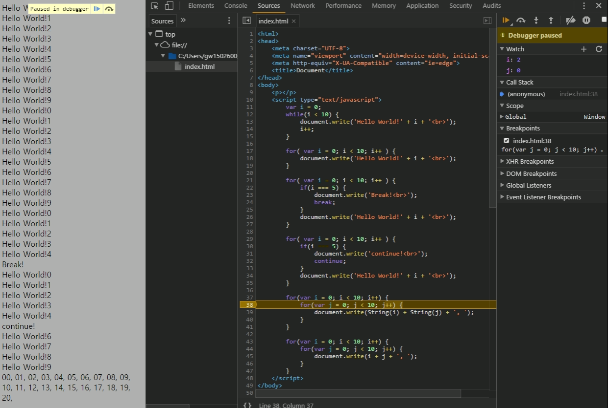

# while과  for의 차이

### 상태로 루프를 돌리고자 할 땐 while 문을
    int state = 10;
    while (state != 1)
    {
        state %= 2
    }

### 범위로 루프를 돌리고자 할 땐 for 문을
    for (int i = 0; i < 100; ++i)
    {

    }
### break, continue
반복문을 중지, 한번 건너뛰기

### 반복문의 중첩사용 & 디버거
문자 연산: String(i) or i의 차이

스크립트를 sources에서 라인번호에 break를 건후 한줄씩 실행시켜볼 수 있다.
Watch에 변수를 입력해 변수값을 확인 할 수 있다.

